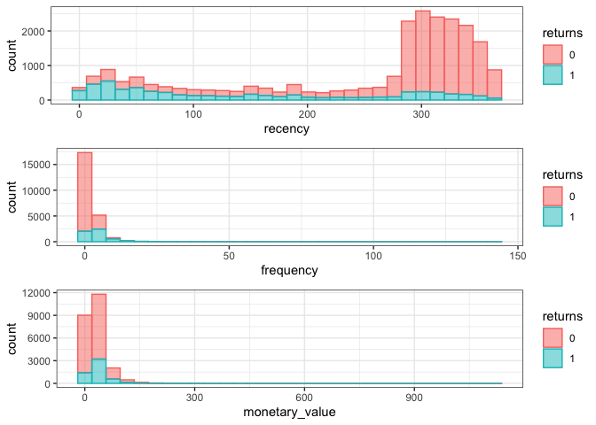

In this project we use the [CDNOW dataset](https://www.brucehardie.com/datasets/) to compare methods for predicting which of a company’s customers will returns over a future period. Such predictions could be of great value, for instance in guiding marketing efforts. Here we might want to specifically target those customers that we predict wouldn’t return, in order to potentially change their mind. Conversely, other marketing campaigns might serve to reward our active customers, in which case we only want to spend money on those that we expect to actually be active in the future.  

First we explore the data and provide some high-level analysis. We then train two models and design an intuitive baseline to help determine the value of our models. Lastly we analyze model performance.  

## 1. Imports

```r
# Import libraries
library(dplyr)
library(BTYD)
library(MLmetrics)
library(ggplot2)
library(gridExtra)

# Import data
df <- read.table('data/CDNOW_master.txt')
df[1:5, ]
cat('Number of rows: ', nrow(df), '\n',
    'Number of columns: ', ncol(df), sep = '')
```

<div data-pagedtable="false">
  <script data-pagedtable-source type="application/json">
{"columns":[{"label":[""],"name":["_rn_"],"type":[""],"align":["left"]},{"label":["V1"],"name":[1],"type":["int"],"align":["right"]},{"label":["V2"],"name":[2],"type":["int"],"align":["right"]},{"label":["V3"],"name":[3],"type":["int"],"align":["right"]},{"label":["V4"],"name":[4],"type":["dbl"],"align":["right"]}],"data":[{"1":"1","2":"19970101","3":"1","4":"11.77","_rn_":"1"},{"1":"2","2":"19970112","3":"1","4":"12.00","_rn_":"2"},{"1":"2","2":"19970112","3":"5","4":"77.00","_rn_":"3"},{"1":"3","2":"19970102","3":"2","4":"20.76","_rn_":"4"},{"1":"3","2":"19970330","3":"2","4":"20.76","_rn_":"5"}],"options":{"columns":{"min":{},"max":[10]},"rows":{"min":[10],"max":[10]},"pages":{}}}
  </script>
</div>

```
## Number of rows: 69659
## Number of columns: 4
```

## 2. Data preparation and analysis

In this project we use the CDNOW data set which can be found on Bruce Hardie's personal [website](https://www.brucehardie.com/datasets/). The current variable names are not very informative. We learn can more about the data by looking at the `read_me_CDNOW_master.txt` file that came with the dataset. Here we learn that the four columns are equal to:

* the customer's ID
* the date of the transaction
* the number of CDs purchased
* the dollar value of the transaction.

The [`BTYD`](https://CRAN.R-project.org/package=BTYD) package we use throughout this project actually has a standard naming convention for these variables. Besides renaming our variables, we need to transform our date variable to the right variable type.


```r
# Change the column names
colnames(df) <- c('cust', 'date', 'quantity', 'sales')

# Convert date column to date type
df$date <- as.Date(as.character(df$date), format = "%Y%m%d")
```

We can now retrieve some basic statistics to learn more about our dataset.


```r
# Basic statistics
df_basicstats <- df %>%
  summarise('Number of customers' = length(unique(cust)),
            'Number of transactions' = n(),
            'Begin period' = min(date),
            'End period' = max(date),
            'Avg. number of transactions per customer' = 
                round(n()  / length(unique(cust)), 2),
            'Avg. transaction value' = round(mean(sales), 2)) %>%
  t() %>%
  data.frame() %>%
  setNames('Statistic')

df_basicstats
```

<div data-pagedtable="false">
  <script data-pagedtable-source type="application/json">
{"columns":[{"label":[""],"name":["_rn_"],"type":[""],"align":["left"]},{"label":["Statistic"],"name":[1],"type":["chr"],"align":["left"]}],"data":[{"1":"23570","_rn_":"Number of customers"},{"1":"69659","_rn_":"Number of transactions"},{"1":"1997-01-01","_rn_":"Begin period"},{"1":"1998-06-30","_rn_":"End period"},{"1":"2.96","_rn_":"Avg. number of transactions per customer"},{"1":"35.89","_rn_":"Avg. transaction value"}],"options":{"columns":{"min":{},"max":[10]},"rows":{"min":[10],"max":[10]},"pages":{}}}
  </script>
</div>

Our data consists of 23.570 customers who in total make 69.659 purchases
over the period 1997-01-01 until 1998-06-30. As mentioned in the `read_me_CDNOW_master.txt` file, all these customers made their first purchase in the first quarter of 1997, such that for these customers this dataset contains their entire purchase history until 1998-06-30.

In this project we test our models by predicting outcomes for a hold-out period which spans the last half year of our data: 1998-01-01 until 1998-06-30. As one would if he/she were to actually make predictions for the next period, we next look at our training data in a little more detail. A good starting point can be to analyze our customers through creating so-called [RFM](https://en.wikipedia.org/wiki/RFM_(market_research)) variables. For each customer, we calculate three statistics:

* **Recency** = days since last transaction
* **Frequency** = number of transactions
* **Monetary value** = Avg. transaction value


```r
# Setting our split date for the hold-out set
split_date <- as.Date('1997-12-31')

# Creating RFM variables
df_rfm <- df %>%
  group_by(cust) %>%
  mutate(returns = ifelse(max(date) > split_date, 1, 0)) %>%
  filter(date <= split_date) %>%
  summarise(recency = as.numeric(split_date - max(date)),
            frequency = n(),
            monetary_value = mean(sales),
            returns = as.factor(mean(returns)))
df_rfm[1:5, ]
```

<div data-pagedtable="false">
  <script data-pagedtable-source type="application/json">
{"columns":[{"label":["cust"],"name":[1],"type":["int"],"align":["right"]},{"label":["recency"],"name":[2],"type":["dbl"],"align":["right"]},{"label":["frequency"],"name":[3],"type":["int"],"align":["right"]},{"label":["monetary_value"],"name":[4],"type":["dbl"],"align":["right"]},{"label":["returns"],"name":[5],"type":["fct"],"align":["left"]}],"data":[{"1":"1","2":"364","3":"1","4":"11.770","5":"0"},{"1":"2","2":"353","3":"2","4":"44.500","5":"0"},{"1":"3","2":"36","3":"5","4":"27.894","5":"1"},{"1":"4","2":"19","3":"4","4":"25.125","5":"0"},{"1":"5","2":"19","3":"10","4":"34.814","5":"1"}],"options":{"columns":{"min":{},"max":[10]},"rows":{"min":[10],"max":[10]},"pages":{}}}
  </script>
</div>

Here we also included our target variable (`returns`), which indicates whether a customer makes at least one purchase in our hold-out period. Let's look at some statistics for these variables.


```r
summary(df_rfm[-1])
```

```
##     recency        frequency       monetary_value    returns  
##  Min.   :  0.0   Min.   :  1.000   Min.   :   0.00   0:18196  
##  1st Qu.:158.0   1st Qu.:  1.000   1st Qu.:  14.96   1: 5374  
##  Median :296.0   Median :  1.000   Median :  24.84            
##  Mean   :243.4   Mean   :  2.414   Mean   :  32.63            
##  3rd Qu.:327.0   3rd Qu.:  3.000   3rd Qu.:  39.82            
##  Max.   :364.0   Max.   :143.000   Max.   :1119.68
```

It turns out that approximately 23\% (5,374/(18,196+5,374)) of our sample returns over our hold-out set. Furthermore, it appears we do have some rather big spenders judging from the max frequency and monetary value. Let's take a closer look at the distributions of our RFM variables. We can also group the customers by our target variable, to see if there are some differences here.


```r
ggplot2::theme_set(theme_bw())

# Function for each individual plot
plot_column <- function(df, column){
  ggplot(data = df_rfm, aes_string(x = column, fill = 'returns', 
                                   color = 'returns')) + 
    geom_histogram(alpha=0.5)
}

# Making and arranging the plots
plot_list <- lapply(c('recency', 'frequency', 'monetary_value'), plot_column, 
                    df = df_rfm)
grid.arrange(grobs = plot_list,
             nrow = 3)
```

<!-- -->

This shows even more clearly that some of our customers are much more active than the majority. If we would not be sure that our raw data is clean (in our case it is), it might be a good idea to look into the transaction records of these customers and look for any errors. In our data these very active customers might be resellers, for example. (Note that the heterogeneity in the customer base might be a good reason to incorporate some type of segmentation into our models. For simplicity sake we forego this, but an interesting example of a BTYD model that can do this is [this paper](https://doi.org/10.1287/mksc.1090.0502) by Abe (2008).)

The recency plot does seem to indicate that customers that have purchased more recently, are more likely to returns in the hold-out, which is to be expected. 

## 3. Predicting returns
Our goal is to predict the outcome of the `returns` variable. To do so we make use of so-called `but-till-you-die' (BTYD) models, which we compare to a baseline heuristic.

### 3.1 Pareto/NBD and BG/NBD model
The Pareto/NBD model by [Schmittlein et al. (1987)](https://doi.org/10.1287/mnsc.33.1.1) stands at the helm of the BTYD models. A more detailed overview of BTYD models can be found [here](http://www.brucehardie.com/talks/ho_cba_tut_art_13.pdf), but roughly these models are built on three components. The first component is a *transaction process* for the occurrence of purchases whilst a customer is 'alive'. E.g. in the Pareto/NBD model, a customer's purchases are assumed to be the product of a Poisson process, dictated by a specific transaction rate. The second component is a *defection process* that determines when a customer churns. For the Pareto/NBD model, the length of the customer's lifetime is assumed to be distributed according to an exponential distribution with a certain defection rate parameter. The third component consists of the structure that allows for *heterogeneity* in these processes across customers. For example, in the Pareto/NBD model the transaction and defection rate parameters are assumed to be distributed over the customer base according to two separate gamma (prior) distributions.

The BG/NBD model by [Fader et al. (2005)](https://doi.org/10.1287/mksc.1040.0098) was later introduced to provide a (more simple) alternative to the Pareto/NBD model. The largest change was the alteration of the defection process into one based on an intuitive discrete mechanism. Specifically, it was now assumed that churn was the result of a simple 'coin flip' after each *repeat* purchase. The defection rate parameter now constitutes the probability with which churn occurs for each customer.

To implement these models, we use the [`BTYD`](https://CRAN.R-project.org/package=BTYD) package in R. In order to be fitted, these models require three pieces of information for each customer:

* `x` = Number of *repeat* purchases (e.g. excl. first purchase)
* `t.x` = Number of days between a customer's first and last purchase
* `T.cal` = Number of days since the customer's first purchase

One could use the `BTYD` package to create this data frame, but creating it ourselves provides more transparency. We create these three variables using our training period and once again create the `returns` variable for our hold-out period. We also create the `recency` variable we saw earlier, which we will later use in our baseline heuristic.


```r
# Making a dataframe to be used by the BTYD package
# Note that for our problem and model, we only need the dates and the id's
df_model <- unique(df[c('cust', 'date')]) %>%
  group_by(cust) %>%
  mutate(returns = ifelse(max(date) > split_date, 1, 0)) %>%
  filter(date <= split_date) %>%
  summarise(x = n() - 1,
            t.x = as.numeric(max(date - min(date))),
            T.cal = as.numeric(max(split_date - date)),
            recency = as.numeric(split_date - max(date)),
            returns = mean(returns)) %>%
  as.data.frame()
df_model[1:5, ]
```

<div data-pagedtable="false">
  <script data-pagedtable-source type="application/json">
{"columns":[{"label":[""],"name":["_rn_"],"type":[""],"align":["left"]},{"label":["cust"],"name":[1],"type":["int"],"align":["right"]},{"label":["x"],"name":[2],"type":["dbl"],"align":["right"]},{"label":["t.x"],"name":[3],"type":["dbl"],"align":["right"]},{"label":["T.cal"],"name":[4],"type":["dbl"],"align":["right"]},{"label":["recency"],"name":[5],"type":["dbl"],"align":["right"]},{"label":["returns"],"name":[6],"type":["dbl"],"align":["right"]}],"data":[{"1":"1","2":"0","3":"0","4":"364","5":"364","6":"0","_rn_":"1"},{"1":"2","2":"0","3":"0","4":"353","5":"353","6":"0","_rn_":"2"},{"1":"3","2":"4","3":"327","4":"363","5":"36","6":"1","_rn_":"3"},{"1":"4","2":"3","3":"345","4":"364","5":"19","6":"0","_rn_":"4"},{"1":"5","2":"9","3":"345","4":"364","5":"19","6":"1","_rn_":"5"}],"options":{"columns":{"min":{},"max":[10]},"rows":{"min":[10],"max":[10]},"pages":{}}}
  </script>
</div>

We now fit the two models, which consists of finding estimates (through a method called [empirical Bayes](https://en.wikipedia.org/wiki/Empirical_Bayes_method) estimation) for the parameters of the prior distributions. 


```r
# Fitting our models
pnbd_params <- pnbd.EstimateParameters(df_model)
bgnbd_params <- bgnbd.EstimateParameters(df_model)

cat('Pareto/NBD parameters (r, alpha, s, beta):',  round(pnbd_params, 2), '\n',
    'BG/NBD parameters (r, alpha, a, b):',  round(bgnbd_params, 2), sep = ' ')
```

```
## Pareto/NBD parameters (r, alpha, s, beta): 0.61 87.11 0.36 42.84 
##  BG/NBD parameters (r, alpha, a, b): 0.27 38.08 0.6 2.23
```

We have now arrived at making our return prediction. Here some caution is warranted. One of the central results of the BTYD models is the so-called 'P(alive)' statistic. This statistic represents --- at a certain point in time --- the probability that a customer is alive, or has not yet churned. With the attention that this statistic receives, one might be tempted to (erroneously) use this statistic to make our return prediction. It should be noted however, that *a customer being alive is no guarantee of the customer actually making a purchase over the next period*. A customer might simply purchase infrequently, meaning they might not return over our half-year prediction interval. 

What some might not know is that these models are directly capable of producing a probability for a customer making at least one purchase over the next period. Derivations for these probabilities can be found [here](http://www.brucehardie.com/notes/028/pareto_nbd_conditional_pmf.pdf) for the Pareto/NBD model and [here](http://www.brucehardie.com/notes/039/bgnbd_derivation__2019-11-06.pdf) for the BG/NBD model. As a testament to how easy this is to miss, this probability is unfortunately not implemented in the `BTYD` package. In contrast to the 'P(alive)' statistic, we'll therefore have to code these probabilities ourselves. The code (hidden by default) for calculating **'return probability'** using the Pareto/NBD or BG/NBD model can be found below. It is written such that it can be combined seamlessly with the `BTYD` package.


```{.r .fold-hide}
pnbd.ConditionalReturnProbability <- function (params, T.star, x, t.x, T.cal) 
{
  max.length <- max(length(x), length(t.x), length(T.cal))
  if (max.length%%length(x)) 
    warning("Maximum vector length not a multiple of the length of x")
  if (max.length%%length(t.x)) 
    warning("Maximum vector length not a multiple of the length of t.x")
  if (max.length%%length(T.cal)) 
    warning("Maximum vector length not a multiple of the length of T.cal")
  dc.check.model.params(c("r", "alpha", "s", "beta"), params, 
                        "pnbd.DERT")
  if (any(x < 0) || !is.numeric(x)) 
    stop("x must be numeric and may not contain negative numbers.")
  if (any(t.x < 0) || !is.numeric(t.x)) 
    stop("t.x must be numeric and may not contain negative numbers.")
  if (any(T.cal < 0) || !is.numeric(T.cal)) 
    stop("T.cal must be numeric and may not contain negative numbers.")
  r <- params[1]
  alpha <- params[2]
  s <- params[3]
  beta <- params[4]
  # See equation (22) in Fader (2014) - Deriving the Conditional PMF...
  if (alpha >= beta){
    F1 <- gsl::hyperg_2F1(r + s + x, s + 1, r + s + x + 1, (alpha - beta)/(alpha + t.x))
    F2 <- gsl::hyperg_2F1(r + s + x, s, r + s + x + 1, (alpha - beta)/(alpha + T.cal))
    F3 <- gsl::hyperg_2F1(r + s + x, s, r + s + x + 1, (alpha - beta)/(alpha + T.cal + T.star))
    # Using a/b = exp(log(a) - log(b)) to rewrite fraction
    # Then using log(c+d) = log(c) + log(1 + d/c) to rewrite log(a) and log(b)
    l.num <- log( 1 + exp(log(r + x) + log(F3) - (r + s + x) * log(alpha + T.cal + T.star) -
                            log(s) - log(F1) + (r + s + x) * log(alpha + t.x)))
    l.denum <- log( 1 + exp(log(r+x) + log(F2) - (r + s + x) * log(alpha + T.cal) -
                              log(s) - log(F1) + (r + s + x) * log(alpha + t.x)))
  } else{
    F1 <- gsl::hyperg_2F1(r + s + x, r + x, r + s + x + 1, (beta - alpha)/(beta + t.x))
    F2 <- gsl::hyperg_2F1(r + s + x, r + x + 1, r + s + x + 1, (beta - alpha)/(beta + T.cal))
    F3 <- gsl::hyperg_2F1(r + s + x, r + x + 1, r + s + x + 1, (beta - alpha)/(beta + T.cal + T.star))
    l.num <- log( 1 + exp(log(r + x) + log(F3) - (r + s + x) * log(beta + T.cal + T.star) -
                            log(s) - log(F1) + (r + s + x) * log(beta + t.x)))
    l.denum <- log( 1 + exp(log(r+x) + log(F2) - (r + s + x) * log(beta + T.cal) -
                              log(s) - log(F1) + (r + s + x) * log(beta + t.x)))
  }
  return(1 - exp(l.num - l.denum))
}

bgnbd.ConditionalReturnProbability <- function(params, T.star, x, t.x, T.cal) 
{
  max.length <- max(length(x), length(t.x), length(T.cal))
  if (max.length%%length(x)) 
    warning("Maximum vector length not a multiple of the length of x")
  if (max.length%%length(t.x)) 
    warning("Maximum vector length not a multiple of the length of t.x")
  if (max.length%%length(T.cal)) 
    warning("Maximum vector length not a multiple of the length of T.cal")
  dc.check.model.params(c("r", "alpha", "a", "b"), params, 
                        "bgnbd.PAlive")
  if (any(x < 0) || !is.numeric(x)) 
    stop("x must be numeric and may not contain negative numbers.")
  if (any(t.x < 0) || !is.numeric(t.x)) 
    stop("t.x must be numeric and may not contain negative numbers.")
  if (any(T.cal < 0) || !is.numeric(T.cal)) 
    stop("T.cal must be numeric and may not contain negative numbers.")
  x <- rep(x, length.out = max.length)
  t.x <- rep(t.x, length.out = max.length)
  T.cal <- rep(T.cal, length.out = max.length)
  r = params[1]
  alpha = params[2]
  a = params[3]
  b = params[4]
  y = 0
  
  beta.ratio = function(a, b, x, y) {
    exp(lgamma(a) + lgamma(b) - lgamma(a + b) - lgamma(x) - 
          lgamma(y) + lgamma(x + y))
  }
  l.A <- log(beta.ratio(a + 1, b + x - 1, a, b)) + lgamma(r + x) - lgamma(r) + 
    r * log(alpha) - (r + x) * log(alpha + t.x)
  l.B <- log(beta.ratio(a, b + x + y, a, b)) + lgamma(r + x + y) - lgamma(r) - log(factorial(y)) +
    r * log(alpha) + y * log(T.star) - (r + x + y) * log(alpha + T.cal + T.star)
  l.num <- l.A + log(1 + exp(l.B - l.A))
  l.num[x == 0] <- l.B[x == 0]
  l.llh.1 <- log(beta.ratio(a, b + x, a, b)) + lgamma(r + x) + r * log(alpha) - 
    lgamma(r) - (r + x) * log(alpha + T.cal)
  l.llh.2 <- log(beta.ratio(a + 1, b + x - 1, a, b)) + lgamma(r + x) + r * log(alpha) -
    lgamma(r) - (r + x) * log(alpha + t.x)
  l.denum <- l.llh.1 + log(1 + exp(l.llh.2 - l.llh.1))
  l.denum[x == 0] <- l.llh.1[x == 0]
  return(1 - exp(l.num - l.denum))
}
```

To illustrate the performance difference between the P(alive) statistic and our own return probability statistic, we'll compare predictions using both approaches. To yield a final prediction. we'll use a cut-off value of 0.5. Note however, that this need not be (and likely is not) optimal. Yet, as we have do not have sufficient data to generate a validation period to set our cut-off, this will have to do. Furthermore, since we'll focus on general accuracy (we have no special interest in predicting either 1's or 0's), a well-calibrated model should do well at this cut-off.


```r
# Calculate length of our hold-out period in days
pred_days <- as.integer(max(df$date) - split_date)

# Predicting returns using our 2 models and the `return probability'
df_model$pnbd_return_prob <- pnbd.ConditionalReturnProbability(
                                    params = pnbd_params,
                                    T.star = pred_days,
                                    x = df_model$x,
                                    t.x = df_model$t.x,
                                    T.cal = df_model$T.cal)
df_model$pnbd_return_pred <- as.numeric(df_model$pnbd_return_prob > 0.5)

df_model$bgnbd_return_prob <- bgnbd.ConditionalReturnProbability(
                                    params = bgnbd_params,
                                    T.star = pred_days,
                                    x = df_model$x,
                                    t.x = df_model$t.x,
                                    T.cal = df_model$T.cal)
df_model$bgnbd_return_pred <- as.numeric(df_model$bgnbd_return_prob > 0.5)

# Predicting returns using P(alive)
df_model$pnbd_alive_prob <- pnbd.PAlive(params = pnbd_params,
                                        x = df_model$x,
                                        t.x = df_model$t.x,
                                        T.cal = df_model$T.cal)
df_model$pnbd_alive_pred <- as.numeric(df_model$pnbd_alive_prob > 0.5)

df_model$bgnbd_alive_prob <- bgnbd.PAlive(params = bgnbd_params,
                                          x = df_model$x,
                                          t.x = df_model$t.x,
                                          T.cal = df_model$T.cal)
df_model$bgnbd_alive_pred <- as.numeric(df_model$bgnbd_alive_prob > 0.5)
```

### 3.2 Baseline heuristics
At this point we should ask how we even know whether our models are accurate? To put our model performance into perspective, we'll use two baseline predictions. The first one is the familiar majority rule, where we simply predict that no customer returns. Whilst a bit boring, this will yield an accuracy of 77\%. (Note that in reality we might not even know what the majority class is, and our training data might be too short to figure this out correctly)  


```r
# Simple majority rule 
df_model$majority_pred <- 0
```

Our second baseline is one that seems to be the go-to in the literature on this subject (see for example [Wubben and Wangenheim (2008)](https://doi.org/10.1509/jmkg.72.3.082). This one is based on a 'hiatus heuristic' often set by managers or others familiar with the business or industry. This hiatus heuristic dictates that customers that have not returned *x* days are not expected to return over the next period either. In our case we have no acces to individuals that can give us such a heuristic. We can however make one ourselves and in the process make it even *better*. What we can do is optimize *x* based on our hold-out period, something which in reality would obviously not be possible. Yet, this way we find the best rule one could *possibly* set. If our models beat this, they'll beat whatever number a manager could've come up with!


```r
# Function for finding the best cut-off for our heuristic
find_cutoff <- function(recency, return){
  candidates <- seq(min(recency), max(recency))
  
  accuracy_cutoff <- function(cutoff, recency, return){
    prediction <- as.numeric(recency <= cutoff)
    return(sum(prediction == return) / length(return))
  }
  
  accuracies <- sapply(X = candidates, 
                      FUN = accuracy_cutoff, 
                      recency = recency, 
                      return = return)
  return(list('max' = max(candidates[which.max(accuracies)]),
              'scores' = cbind(candidates, accuracies)))
}

# Find the optimal cutoff and make predictions
optimal_cutoff <- find_cutoff(df_model$recency, df_model$returns)[[1]]
df_model$heuristic_pred <- as.numeric(df_model$recency <= optimal_cutoff)

cat('The optimal cut-off point lies at ', optimal_cutoff, ' days.', sep='')
```

```
## The optimal cut-off point lies at 81 days.
```


## 4. Evaluating predictions

### 4.1 Cut-off dependent measures
We now evaluate the performance of our models. We start by looking at the accuracy. Whilst we focus on the accuracy (we have no cost function/reason to look at 1's or 0's specifically), we provide the confusion matrix entries such that one can calculate any statistic of interest (F1 scores, recall etc.) themselves.


```r
# Function for evaluating predictions
evaluate_pred <- function(pred, actual, names = NULL){
  if (is.null(names)){
    names = c(colnames(pred))
  }
  measures <- c('Accuracy', 'TP', 'FP', 'TN', 'FN')
  output <- data.frame(matrix(NA, nrow = ncol(pred), ncol = length(measures)))
  colnames(output) <- measures
  rownames(output) <- names
  for (i in (1:ncol(pred))){
    predictions <- pred[i]
    TP <- as.numeric(sum(predictions == 1 & actual == 1))
    FP <- as.numeric(sum(predictions == 1 & actual == 0))
    TN <- as.numeric(sum(predictions == 0 & actual == 0))
    FN <- as.numeric(sum(predictions == 0 & actual == 1))
    output[i, 'Accuracy'] <- 100 * (TP + TN) / (TP + FP + TN + FN)
    output[i, c('TP', 'FP', 'TN', 'FN')] <- c(TP, FP, TN, FN)
  }
  return(output)
}

# Output
round(evaluate_pred(df_model[c('pnbd_return_pred', 'bgnbd_return_pred',
                         'pnbd_alive_pred', 'bgnbd_alive_pred',
                         'heuristic_pred', 'majority_pred')],
              df_model$returns), 2)
```

<div data-pagedtable="false">
  <script data-pagedtable-source type="application/json">
{"columns":[{"label":[""],"name":["_rn_"],"type":[""],"align":["left"]},{"label":["Accuracy"],"name":[1],"type":["dbl"],"align":["right"]},{"label":["TP"],"name":[2],"type":["dbl"],"align":["right"]},{"label":["FP"],"name":[3],"type":["dbl"],"align":["right"]},{"label":["TN"],"name":[4],"type":["dbl"],"align":["right"]},{"label":["FN"],"name":[5],"type":["dbl"],"align":["right"]}],"data":[{"1":"81.94","2":"2449","3":"1332","4":"16864","5":"2925","_rn_":"pnbd_return_pred"},{"1":"82.06","2":"2055","3":"910","4":"17286","5":"3319","_rn_":"bgnbd_return_pred"},{"1":"78.05","2":"3570","3":"3369","4":"14827","5":"1804","_rn_":"pnbd_alive_pred"},{"1":"31.43","2":"4460","3":"15249","4":"2947","5":"914","_rn_":"bgnbd_alive_pred"},{"1":"80.97","2":"2428","3":"1540","4":"16656","5":"2946","_rn_":"heuristic_pred"},{"1":"77.20","2":"0","3":"0","4":"18196","5":"5374","_rn_":"majority_pred"}],"options":{"columns":{"min":{},"max":[10]},"rows":{"min":[10],"max":[10]},"pages":{}}}
  </script>
</div>
We find notable performance differences between the performance using our return probability (`*_return_pred`) and the P(alive) statistic (`*_alive_pred`). This holds especially for the BG/NBD model, where the return probability yields an accuracy that is more than twice as high. By looking at the number of false positives, we have actually uncovered a big drawback over the BG/NBD model. We see that many customers are deemed alive (meaning they are predicted to return). Given that in the BG/NBD model, by construction customers can churn *only* after a repeat purchase, any customers with only one purchase (the initial purchase) are automatically deemed to be alive. This is problematic, as especially those customers that have been completely inactive after their first purchase would be unlikely to return. (For those interested, the MBG/NBD model by [Batislam et al. (2008)](https://doi.org/10.1016/j.ijresmar.2006.12.005) and CBG/NBD model by [Hoppe and Wagner (2007)](https://doi.org/10.15358/0344-1369-2007-JRM-2-75) both adjust the BG/NBD model in an attempt to tackle this.  

If we look at our heuristics, we first see that our return probability prediction fortunately beats the majority rule by a decent margin. The hiatus heuristic prediction performs decently well, which is to be expected as it is optimized on our hold out set. Regardless, our two models manage to beat this baseline also. As for the differences between our models, the differences do not really seem conclusive. Yet, the Pareto/NBD model appears to perform better at predicting positives (returning customers), and worse at predicting negatives at this cut-off.

### 4.1 Cut-off independent measures

A drawback of looking at the above metrics is that they are cut-off dependent. A common alternative that represent general predictive accuracy is the area under the receiver operator characteristic curve [AUROC](https://towardsdatascience.com/intuition-behind-roc-auc-score-1456439d1f30). Another reason for looking past cut-off dependent measures is that we might be interested in the actual probability values. For example, it might be that managers want to use our models as an additional tool in determining who will return, together with other factors. To get a feel of how good our probability measures are, we can use the [log-loss](https://towardsdatascience.com/intuition-behind-log-loss-score-4e0c9979680a) score.


```r
# Function for evaluating probabilities
evaluate_prob <- function(prob, actual, names = NULL){
  if (is.null(names)){
    names = c(colnames(prob))
  }
  actual <- as.vector(actual)
  measures <- c('AUROC', 'Log-loss')
  output <- data.frame(matrix(NA, nrow = ncol(prob), ncol = length(measures)))
  colnames(output) <- measures
  rownames(output) <- names
  for (i in (1:ncol(prob))){
    probabilities <- as.vector(prob[[i]])
    output[i, 'AUROC'] <- MLmetrics::AUC(probabilities, actual)
    output[i, 'Log-loss'] <- MLmetrics::LogLoss(probabilities, actual)
  }
  return(output)
}

# Output
round(evaluate_prob(df_model[c('pnbd_return_prob', 'bgnbd_return_prob')],
              df_model$returns), 4)
```

<div data-pagedtable="false">
  <script data-pagedtable-source type="application/json">
{"columns":[{"label":[""],"name":["_rn_"],"type":[""],"align":["left"]},{"label":["AUROC"],"name":[1],"type":["dbl"],"align":["right"]},{"label":["Log-loss"],"name":[2],"type":["dbl"],"align":["right"]}],"data":[{"1":"0.7998","2":"0.4208","_rn_":"pnbd_return_prob"},{"1":"0.7882","2":"0.4244","_rn_":"bgnbd_return_prob"}],"options":{"columns":{"min":{},"max":[10]},"rows":{"min":[10],"max":[10]},"pages":{}}}
  </script>
</div>

Again, differences between our models are small. Yet, the Pareto/NBD model seems to just edge out the BG/NBD model in both AUROC and log-loss performance. For this reason, the Pareto/NBD might be the model of choice for this dataset.

## 5. Wrap-up
We set out to predict which customers of a CD retailer would return over an upcoming half-year period. To make these predictions we trained on these customers' historical transaction data and employed the Pareto/NBD and BG/NBD model. To test our models we compared performance against a baseline heuristic, which we even optimized using the hold-out set. Both models beat the baseline, with the Pareto/NBD model performing slightly better on cut-off independent measures. We also found that one should be cautious in using the well-known P(alive) for this prediction task, with the 'return probability' for which we provide code giving far superior results.

## References

[1] Fader, Peter S. and Bruce G.,S. Hardie, (2001), "Forecasting Repeat Sales at CDNOW: A Case Study," Interfaces, 31 (May-June), Part 2 of 2, S94-S107.  
[2] https://en.wikipedia.org/wiki/RFM_(market_research)  
[3] Abe, M. (2009). “Counting your customers” one by one: A hierarchical Bayes extension to the Pareto/NBD model. Marketing Science, 28(3), 541-553. 
[4] Schmittlein, D. C., Morrison, D. G., & Colombo, R. (1987). Counting your customers: Who-are they and what will they do next?. Management science, 33(1), 1-24.  
[5] Fader, P. S., & Hardie, B. G. (2009). Probability models for customer-base analysis. Journal of interactive marketing, 23(1), 61-69.  
[7] Fader, P. S., Hardie, B. G., & Lee, K. L. (2005). “Counting your customers” the easy way: An alternative to the Pareto/NBD model. Marketing science, 24(2), 275-284.  
[6] https://CRAN.R-project.org/package=BTYD
[7] Fader, P. S. and Hardie, B. G. (2014). Deriving the Conditional PMF of the Pareto/NBD Model.  
[8] Fader, P. S., Hardie, B. G., and Lee, K. L. (2019). A Step-by-Step Derivation of the BG/NBD Model.  
[9] Wübben, M., & Wangenheim, F. V. (2008). Instant customer base analysis: Managerial heuristics often “get it right”. Journal of Marketing, 72(3), 82-93.  
[10] Batislam, E. P., Denizel, M., and Filiztekin, A. (2007). Empirical validation and comparison of models for customer base analysis. International Journal of Research in Marketing, 24(3):201–209.  
[11] Hoppe, D. and Wagner, U. (2007). Customer base analysis: The case for a central variant of the Betageometric/NBD model. Marketing ZFP, 29(JRM 2):75–90.  
[12] https://towardsdatascience.com/intuition-behind-roc-auc-score-1456439d1f30   
[13] https://towardsdatascience.com/intuition-behind-log-loss-score-4e0c9979680a
